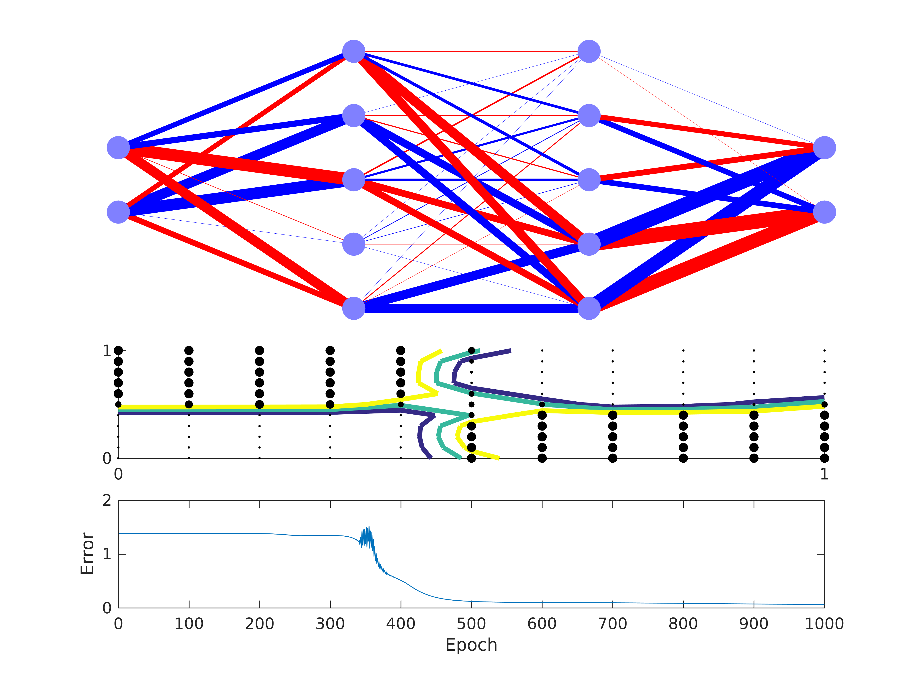

This is a toolbox for deep neural networks implemented in MATLAB. It supports classification, as well as regression using neural networks. It has the following features:

- Flexibility to build custom activation functions with several already implemented (tanh, logistic, ReLU, softmax, sinusoid, linear, Max-pooling)
- Flexibility for error functions (quadratic loss, cross-entropy)
- Visualization of network architectures (show_network)
- Minibatch training
- L1 and L2 regularization (see deeper_classification_regularization.m tutorial)
- Importance extraction methods (OD, LRP) in a flexible manner.
- Allows separate learning rate for each layer and even for each connection
- Selection of optimization algorithms with and without momentum (SGD, RMSprop ; check out in model_train_fast_momentum)
- Feature Elimination (FE) which in combination with regularizers it removes non-important nodes. (see deeper_classification_regularization_feature_elimination.m tutorial)

</a>

Observations

- Use cross entropy loss function with softmax activation function in the output layer only. It doesn't make much sense otherwise. And also use of logistic in the other layers gives better results.
- Different activation function may require different learning rates. And then also different amount of training epochs.
- If the error over time seems to make spiky oscillations, probably it's stuck on the sides of a minimum and the large learning rate does not allow it to go down to the minimum. Reducing learning rate will probably help, increasing minibatch size might also help (more samples seek for a smoother minimum)

To implement next:
- Total variation regularization
- Drop out
- Nesterov momentum

Attention: Combination of ReLU+Softmax+Cross-entropy can cause exploding gradient. The gradient explosion depends on how the parameters are initialized. Therefore, it might explode when running the script which leads to nonsense models (all or part of the parameters become NaNs). This issue is addressed in (1) and can be avoided to some extent by using L1 or L2 regularization.

(1) https://arxiv.org/pdf/1211.5063.pdf

